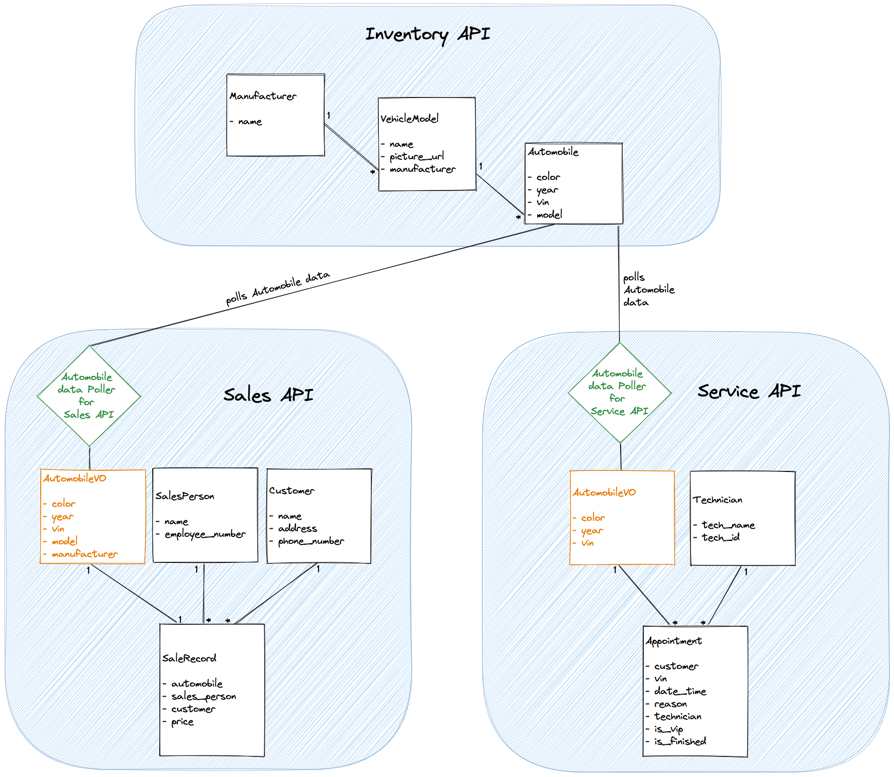

# CarCar

Team:

* Cameron Guadagnino - Services
* Ariana Kim - Sales

## Design

As shown on the diagram below, there are 3 bounded contexts:
1) Inventory API
2) Sales API
3) Service API

The Inventory API has 3 models: Manufacturer, Vehicle Model, and Automobile. The Automobile model includes data from Vehicle Model, which includes data from Manufacturer.

The Sales API and the Service API both have a poller that polls for the Automobile data from the Inventory API into the Sales API and Service API bonded contexts respectively. In both Sales and Service APIs, the data polled is stored in an AutomobileVO model, which is a value object.

## Service microservice

Starting off we analyze what we need to collect data for, and we realize we are going to need information from the vehicles, appointments, and technicians
we then know what kind of modles we will need. After creating the models with the required input forms to specification from our architecht, we need to create
a way to visualize these models in insomnia to test them. After creating python views, we are able to check out models in python and see that they're functioning. 
After this we can then create our forms and lists in JavaScript allowing us to represent all this information in react. This is important because it allows us
to create a way to recieve data from out webpage. After this we process the data in an interactable list, where we can visualize the data model.

## Sales microservice

The Sales API has 4 models and a poller.
The 4 models are:
1) AutomobileVO
2) SalesPerson
3) Customer
4) SalesRecord

### Models

The AutomobileVO model represents a car (with color, year, vin, model, and manufacturer as its attributes), and gets its data from the poller from the Inventory API (to be explained later).

The SalesPerson model represents a sales person (with name and employee number as attributes) that sells cars at the dealership.

The Customer model represents a potential customer (with name, address, and phone number as attributes) that would purchase a car from the dealership.

The SaleRecord model represents a sale record for a car. As attributes, it has an automobile that is in the inventory, the sales person who sold the car, the customer that bought the car, and the price at which the car was purchased. Only one sale record can exist for a car in the inventory.

### Poller

The Sales API has a poller that gets the Automobile data from the Inventory API and stores it in the AutomobileVO model in the Sales API. This is the integration point between the Inventory API and the Sales API. Once the Automobile data from the Inventory API is available in the Sales API through the AutomobileVO model, then the SaleRecord model can use the automobile data (stored in the AutomobileVO) to makes sale record instances.

### Application

The Graphical Human Interface is implemented with React. On the Sales side, the following pages are available:
* Create a Sales Person
* Create a Potential Customer
* Create a Sale Record
* Sales Records List
* Sales Person History

